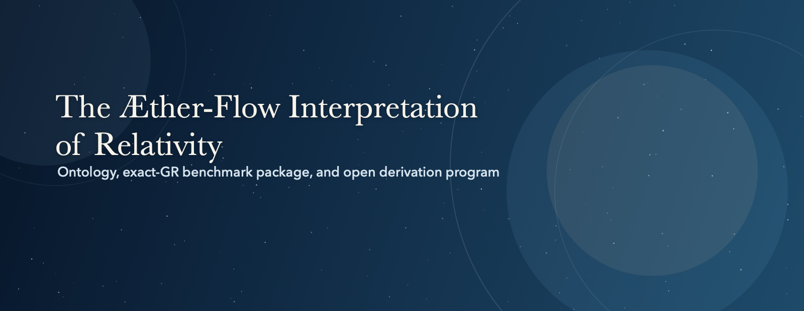

  

# The Æther-Flow Interpretation of Relativity

This repository is designed to be readable even if you are new to GitHub, and it is the active LaTeX workspace for `The Æther-Flow Interpretation of Relativity`. The overview-first exact-closure package is the benchmark public theory statement, while the downstream substrate program asks whether that benchmark can be derived from explicit substrate structure without changing the claim boundary prematurely.

> **First time here:** Start with [Start Here](docs/start-here.md). If you mainly want to read the project rather than inspect the repository, prefer the PDF links in the [Theory Package](docs/theory-package.md) page or begin with the [Front-Facing Article](docs/front-facing-article.md).

## Quick Links

[Start Here](docs/start-here.md) · [Theory Package](docs/theory-package.md) · [What This Package Is Not](docs/what-this-package-is-not.md) · [Active Research](docs/research-archive.md) · [Review Packets](docs/review_packets/README.md) · [How to Review](docs/how-to-review.md) · [AI Collaboration and Method](docs/ai-collaboration-and-method.md) · [Manuscript Wiki](docs/manuscript-wiki-workflow.md)

## Choose Your Path

- **New to the project:** Go to [Start Here](docs/start-here.md) for the reading order, the first clicks to make, and the quickest way into the repository.
- **Curious non-specialist:** Read the [Front-Facing Article](docs/front-facing-article.md), then open the [Overview PDF](docs/assets/pdfs/aether_flow_exact_closure_sequence_overview.pdf) for the benchmark package in reading form.
- **Physics / math reader:** Go straight to the [Theory Package](docs/theory-package.md), then use [How to Review](docs/how-to-review.md) for the intended audit path.
- **Reviewer / AI collaborator:** Use [Review Packets](docs/review_packets/README.md), [AI Collaboration and Method](docs/ai-collaboration-and-method.md), and the [Manuscript Wiki workflow](docs/manuscript-wiki-workflow.md) to find the right handoff or retrieval surface quickly.

## What This Project Is

This repository is a research hub, a public reading path, and a working manuscript space at the same time. It is meant to help readers, reviewers, and collaborators navigate the project.

At the scientific level, the repository presents `The Æther-Flow Interpretation of Relativity` as an exact relativistic theory statement built on the `Æther` / `Æther-flow` ontology. Its public front door is the overview-first exact-closure package, while the downstream derivational manuscripts remain answerable to that benchmark package rather than replacing it.

## What It Currently Claims

- The overview-first exact-closure package is the benchmark public theory statement and the canonical front door of the repository.
- `The Æther-Flow Interpretation of Relativity` is the active exact relativistic theory statement built on the `Æther` / `Æther-flow` ontology.
- GR is adopted exactly in the benchmark package as the operational relativistic sector with ordinary matter coupling.
- At current scope, the project is an exact-GR benchmark and interpretive package, not a low-energy modification or replacement of GR.
- The current frozen primitive-reservoir line ends in the scoped verdict `Not Derived On Current Line`.
- Any resumed derivational work must begin on a genuinely new line with explicit observer-localizing structure and a concretely completed [charter](docs/NEW_LINE_DERIVATION_CHARTER.md).

## What This Package Is Not

If you only need the compact comparison layer, start with [What This Package Is Not](docs/what-this-package-is-not.md).

- Not Einstein-aether: the benchmark package does not add a dynamical preferred-frame vector field in the low-energy action; the congruence / `Æther-flow` layer is a GR observer-kinematics dictionary inside the adopted metric spacetime.
- Not Hořava or preferred-foliation gravity: the active package does not claim a preferred slicing, modified low-energy symmetry structure, or an extra low-energy foliation sector.
- Not a low-energy non-GR alternative: at observable scale the package is ordinary GR with one operative metric and universal matter coupling.
- Not a completed derivation of GR: exact relativistic adoption is the benchmark result now; first-principles substrate derivation remains open downstream.
- Not a still-live frozen-line program: the current frozen primitive-reservoir line already ends in the scoped verdict `Not Derived On Current Line`, so another same-output relay below that frozen object is not the current front-line task.

The positive mirror is equally simple: the exact-GR benchmark package is the public result now, the derivational burden is downstream and still open, and the frozen current line is already preserved under `Not Derived On Current Line`.

## Plain-Language Glossary

If you want the repository's compact naming note for these terms, start with [Æther-Flow Naming and Vocabulary](docs/AETHER_FLOW_NAMING_AND_VOCABULARY.md). If you want a more reader-friendly orientation first, use the [Front-Facing Article](docs/front-facing-article.md).

- `Æther`: the project's name for the deeper four-dimensional substrate of reality. In the active manuscripts, it is the underlying four-dimensional substrate of reality.
- `Æther-flow`: the ordered motion of that deeper substrate. In the active manuscripts, it is the intrinsic ordered motion of the `Æther`.
- observed three-dimensional space: the space we experience locally. In project language, it is the observer-level local experiential slice of the deeper substrate.
- local experiential slice: the repository's phrase for that observer-level cut through the deeper substrate that appears to us as ordinary space.
- `S-time`: the experienced order of change. In project language, it arises from matter, light, and the `Æther-flow`.
- exact closure: the benchmark stance that the operational relativistic sector agrees exactly with GR.
- adoption: use of established relativistic dynamics without claiming first-principles substrate recovery.
- derivation: first-principles recovery of the relativistic sector from explicit substrate structure.

## Repository Map

- **Authoring manuscripts** — [`manuscripts/active/tex/`](manuscripts/active/tex/): the active `.tex` files and the scientific source of truth.
- **Built reading copies** — [`manuscripts/active/pdf/`](manuscripts/active/pdf/): generated PDFs for human reading, sharing, and review.
- **Public orientation and policy** — [`docs/`](docs/): guided entry pages, vocabulary notes, claim-boundary notes, and public-facing documentation.
- **Review handoff bundles** — [`docs/review_packets/`](docs/review_packets/): organized review packets for outside readers, including AI and human-oriented formats.
- **Live research board** — [`RESEARCH_PLAN.md`](RESEARCH_PLAN.md): the current progress and direction surface for ongoing work.
- **Operational checklist** — [`EXECUTION_CHECKLIST.md`](EXECUTION_CHECKLIST.md): the active checklist for manuscript and workflow execution.

## How This Repo Works

1. New manuscript writing and revision happen in `.tex`, not in Markdown or another authoring format.
2. The active `.tex` manuscripts under `manuscripts/active/tex/` are the scientific authority for the project.
3. The PDFs under `manuscripts/active/pdf/` and `docs/assets/pdfs/` are compiled reading deliverables and the most convenient reading surface for most visitors.
4. The local Manuscript Wiki is a retrieval and navigation layer that helps agents and collaborators find the right material quickly; it does not replace the active `.tex` manuscripts as authority.
5. The root `README.md` and the pages under `docs/` are orientation surfaces: they explain how to navigate the project, but they are not the primary scientific record.
6. The public reading order starts with the benchmark exact-closure package before the downstream derivational program and archive context.

## For AI Agents And Advanced Collaborators

- [AGENTS.md](AGENTS.md): repo-local working rules for academic writing, terminology, build discipline, routing discipline, and support-tooling workflow.
- [Manuscript Wiki workflow](docs/manuscript-wiki-workflow.md): the compact guide for build, sync, lint, and authority-order commands.
- [Active manuscript file map](docs/ACTIVE_MANUSCRIPT_FILE_MAP.csv): the routing control layer for manuscript status, front-door classification, and current-line discipline.
- [Active manuscript file map guide](docs/ACTIVE_MANUSCRIPT_FILE_MAP_GUIDE.md): the taxonomy and update rules behind that routing layer.
- Operational rule: use the wiki and file map for navigation first, then verify substantive scientific claims in the active `.tex` manuscripts.

## Review And Provenance

This repository is set up for outside reading as well as active internal work. The review and provenance surfaces are meant to make that process easier, clearer, and more disciplined.

- [How to Review](docs/how-to-review.md): the intended audit path for physicists, mathematicians, and technically trained readers.
- [Review Packets](docs/review_packets/README.md): structured handoff bundles for outside review.
- [AI Collaboration and Method](docs/ai-collaboration-and-method.md): provenance and workflow context for the AI-assisted research process used in the repository.

## More On Æther And Æther-Flow

The README uses `Æther` and `Æther-flow` as core project terms, but the fuller explanation lives in linked project documents rather than in the landing page itself.

- [Æther-Flow Naming and Vocabulary](docs/AETHER_FLOW_NAMING_AND_VOCABULARY.md): the compact definitions and preferred wording note for the active project.
- [Front-Facing Article](docs/front-facing-article.md): a more accessible orientation for readers who want the ideas explained before entering the manuscript structure.
- [Theory Package](docs/theory-package.md): the benchmark reading path if you want to see how those concepts are used in the active exact-closure package.

## How To Use The Manuscript Wiki

The Manuscript Wiki is the local retrieval and navigation layer for the project. It is there to help readers and agents find the right manuscript, synced PDF, and routing note quickly without treating the wiki itself as the scientific source of truth.

- Start with [docs/manuscript-wiki-workflow.md](docs/manuscript-wiki-workflow.md) for the default vault path, build commands, sync flow, and lint commands.
- Use the wiki when you need navigation, cross-links, synced PDFs, or note generation around the active manuscripts.
- Do not treat the wiki as the final scientific authority: the active `.tex` manuscripts remain the source of truth.

## How To Use The Scripts Folder

The [`scripts/`](scripts/) folder holds the tracked workflow tools for the repository. These scripts exist so contributors and agents can build, sync, validate, and clean the project in a consistent way instead of relying on ad hoc shell commands.

- Use [`scripts/build_aether_pdf.sh`](scripts/build_aether_pdf.sh) to build active manuscripts and, when needed, sync the resulting PDFs into the wiki workflow.
- Use [`scripts/check_manuscript_wiki.sh`](scripts/check_manuscript_wiki.sh), [`scripts/sync_manuscript_wiki_pdfs.py`](scripts/sync_manuscript_wiki_pdfs.py), and [`scripts/generate_manuscript_wiki_notes.py`](scripts/generate_manuscript_wiki_notes.py) to refresh and verify the local wiki layer.
- Use [`scripts/validate_active_manuscript_file_map.py`](scripts/validate_active_manuscript_file_map.py) when the active manuscript map changes.
- Use [`scripts/clean_aether_pdflatex_artifacts.sh`](scripts/clean_aether_pdflatex_artifacts.sh) to remove leftover LaTeX build artifacts after manual or failed builds.

## How To Use The CSV Control Layer

The project's main CSV control surface is [docs/ACTIVE_MANUSCRIPT_FILE_MAP.csv](docs/ACTIVE_MANUSCRIPT_FILE_MAP.csv). This file is not a manuscript itself; it is the routing layer that tells readers and agents how the active manuscript set is classified and how it should be navigated.

- Use the CSV when you need to know which manuscripts are front door, active supporting, historical-but-kept-active, screened out, or side work.
- Pair the CSV with [docs/ACTIVE_MANUSCRIPT_FILE_MAP_GUIDE.md](docs/ACTIVE_MANUSCRIPT_FILE_MAP_GUIDE.md), because the guide explains what the columns and status labels mean.
- Use the file map before making claims about project status, current main line, or benchmark-facing next steps.
